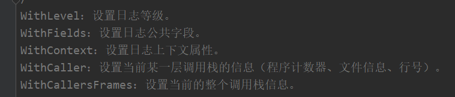
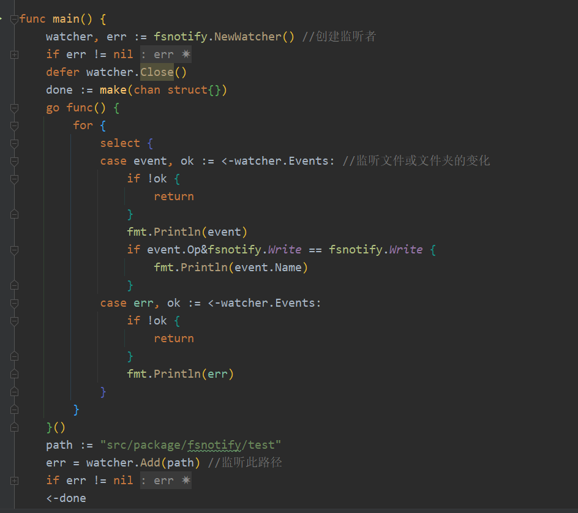

# Blog

## 项目结构图

1.   `bin`  存放二进制文件
2.   `configs` 存放配置文件
3.   `docs` 存放接口文档
4.   `global` 全局变量
5.   `internal` 项目的主体部分
6.   `pkg` 为本项目设计的工具包
7.   `script` 脚本(sql语句等)
8.   `storage` 持久化层,存放日志,保存的图片等

## 数据库

1.   公共model 

      

2.   `blog_article` 文章

     1.   `title` : 标题
     2.   `desc` :描述
     3.   `content` :内容
     4.   `cover_image_url` 图片链接
     5.   `state` :文章状态

3.   `blog_tag` 标签

     1.   `name` 标签名
     2.   ` state` 状态

4.   `blog_article_tag` 文章和标签的关联关系

     1.   `tag_id` 标签id
     2.   `article_id` 文章id

5.   `blog_auth` token信息

     1.   `app_key` app_key
     2.   `app_secret` app_secret

## configs 配置文件

使用viper搭配yaml文件进行配置文件的读取

1.   yaml文件

     

2.   对应结构体

     

3.   对应初始化viper

     

4.   读取配置文件

     

## swaggo 接口文档

<a href="[Go学习笔记(六) | 使用swaggo自动生成Restful API文档 | Razeen`s Blog (razeencheng.com)](https://razeencheng.com/post/go-swagger)">swaggo使用 </a>

1.   安装

     

     如果出现swag未找到,请将下载的`swag.exe`放到`GOPATH/bin/`下

2.   `main`中注释

     

     

3.   Handle 注释

     

     

4.   生成文档和测试

     

     

     在项目运行后直接访问`IP:端口/swagger/index.html` 即可

## global 全局变量

用于项目中的使用

## pkg 项目包

用于将项目中的一些操作统一封装起来

### app 包

1.   app.go

     统一响应处理

     

2.   form.go

     参数绑定 还是利用了`shouldBind`

     

     举例:

     

     参数绑定:

     

3.   jwt.go

     API 权限访问控制

     JWT简介:

     

     

     

     

     >   第一部分指明对第三部分的加密算法以及使用的令牌类型
     >
     >   第二部分存储令牌的相关信息,如有效时间等,用于校验是否过期
     >
     >   第三部分使用一个密钥和第二部分通过第一部分的加密算法进行加密,用于校验令牌内容是否被更改过

     使用 `jwt-go` 包 进行jwt的生成和解析(判断时间和是否被修改过,令牌中无任何声明被认为是有效的)

     

     对应中间件处理

     

4.   分页处理

     统一对分页进行处理

     

5.   time.go

     对时间的格式化处理

     

### convent

1.   convent.go

     对字符转数字的封装

     

### email

邮件服务

1.   email.go

     

### errcode

对错误的统一标记

1.   errcode.go

     对错误的操作封装

     

2.   common_code.go

     通用错误码

     

3.   项目模块错误码

     

### limiter 限流器

使用 `ratelimit` 包实现简单高效地令牌桶

1.   基本属性

     

2.   具体实现

     针对路由限流

     

     对应中间件

     

     使用

     对`/auth`路由进行限流

     

### logger 日志管理

使用 `lumberjack`进行日志的持久化保存

日志内容设置

日志格式化输出

###  setting 热更新配置文件

使用`fsnotify`包实现

`viper`则是通过 `fsnotify` 实现监听

使用:

初始化时加载配置文件

如果文件改变则重新读取配置文件

### upload 文件相关操作

### util

1.   md5.go

     

## middleware中间件

### 访问日志控制

将信息先保存起来,再发送

### 捕获异常

捕获异常并且短信通知

## 项目内容

调用关系

router 层负责数据的整理然后与service层交互,回复数据给客户

service层负责与不同dao层沟通获取数据,返回给router

dao层负责组装数据与model层沟通,返回数据给service层

model层只负责与数据库进行操作,返回有用的数据给dao层

结论: service层的模型负责绑定客户数据和返回给客户.over